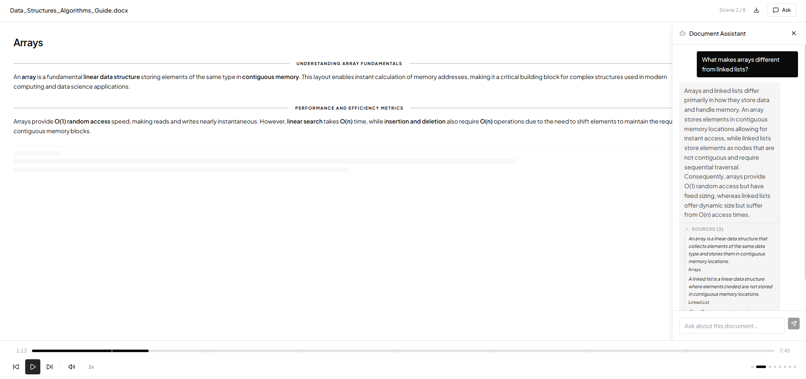
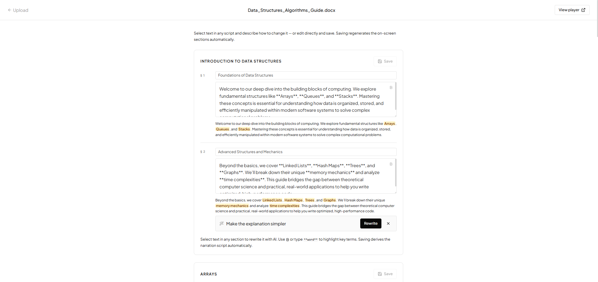
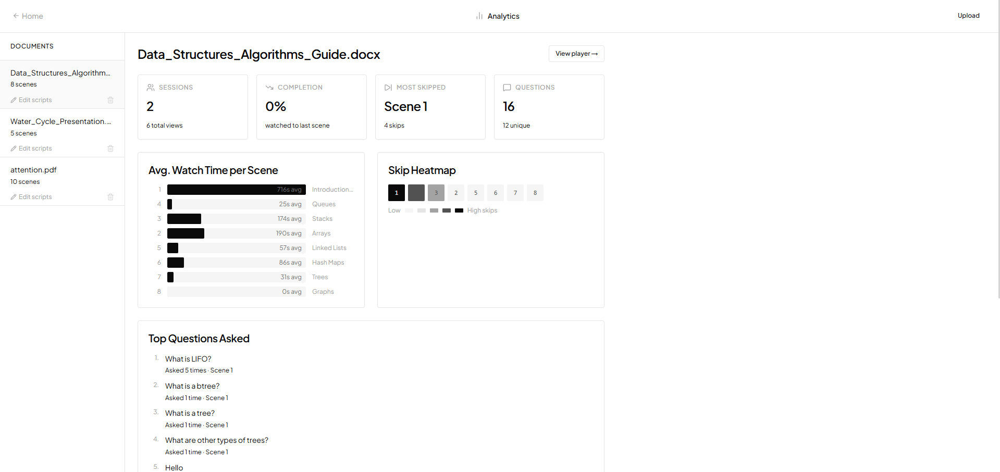

# DocToVideo

AI-powered document-to-interactive-video platform. Upload a PDF, PowerPoint, Google Slide link, or Word doc and the app auto-segments it into scenes, generates spoken narration with Edge TTS, plays it back as an animated presentation with timed highlights, and answers questions about it with verbatim citations from the source.

**Live demo:** https://doctovideo.vercel.app  
**Admin key (upload + dashboard):** `hfuLOqWosymyytJ8xwrcqqziwdNpPiwPoQHYRzjppxM`

---

## Table of contents

1. [What it does](#what-it-does)
2. [Sample inputs and generated output](#sample-inputs-and-generated-output)
3. [Tools used](#tools-used)
4. [Architecture and data flow](#architecture-and-data-flow)
5. [Data sources and accepted formats](#data-sources-and-accepted-formats)
6. [Separation of facts, narration, and AI answers](#separation-of-facts-narration-and-ai-answers)
7. [How grounding works](#how-grounding-works)
8. [Key prompts and prompt iterations](#key-prompts-and-prompt-iterations)
9. [Analytics events](#analytics-events)
10. [Setup](#setup)
11. [Limitations, risks, and review requirements](#limitations-risks-and-review-requirements)

---

## What it does

| Capability             | How                                                                                                                  |
| ---------------------- | -------------------------------------------------------------------------------------------------------------------- |
| **Upload**       | PDF / PPTX / DOCX (up to 25 MB) or a public Google Slides link. Admin-gated.                                         |
| **Auto-segment** | LLM segmentation with structural and token-window fallbacks.                                                         |
| **Narrate**      | One Gemini call per scene → 90–150 spoken-word sections with key-term emphasis.                                    |
| **Voice**        | Microsoft Edge TTS (`en-US-JennyNeural`) — server-side MP3, free, natural prosody.                                |
| **Play**         | Interactive React presentation: scene transitions, timed section reveals tied to audio progress, key-claims sidebar. |
| **Q&A**          | Document-grounded chat with collapsible verbatim quote citations.                                                    |
| **Edit**         | Per-section script editor with AI rewrite of selected text.                                                          |
| **Analytics**    | Per-session funnel, scene watch time, skip heatmap, question frequency (admin).                                      |
| **Download**     | Original document downloadable from the player via signed Supabase Storage URL.                                      |

---

## Sample inputs and generated output

### Sample inputs (in `docs/tests/`)

The repo includes three pre-prepared documents you can upload to reproduce the screenshots below:

| File                                                                                                  | Type                                                 | Size   | What it tests                                                          |
| ----------------------------------------------------------------------------------------------------- | ---------------------------------------------------- | ------ | ---------------------------------------------------------------------- |
| [`docs/tests/attention.pdf`](docs/tests/attention.pdf)                                                 | PDF (academic paper —*Attention Is All You Need*) | ~2 MB  | Long-form PDF extraction, dense technical content, citation grounding  |
| [`docs/tests/Data_Structures_Algorithms_Guide.docx`](docs/tests/Data_Structures_Algorithms_Guide.docx) | DOCX (technical guide)                               | ~30 KB | Heading-based segmentation, multi-scene narration, common-question Q&A |
| [`docs/tests/Water_Cycle_Presentation.pptx`](docs/tests/Water_Cycle_Presentation.pptx)                 | PPTX (presentation)                                  | ~50 KB | Slide-level segmentation, short scenes, simpler concept Q&A            |

### Generated output

This section will use the Data Structures and Algorithms document from the sample inputs folder as an example.

**1. Interactive playback page with Q&A** — the primary deliverable. Each scene plays with TTS narration, on-screen sections reveal in sync with the audio, and viewers can open the Q&A panel to ask grounded questions. Every answer comes with a collapsible verbatim Sources block.



**2. Script editor with AI rewrite** — admin-only. Per-section editor with inline AI rewrite: select any text, type an instruction like *"make the explanation simpler"*, and the model rewrites only that selection while keeping the surrounding tone. Saving re-derives the narration audio.



**3. Analytics dashboard** — admin-only. Per-document metrics: completion rate, most-skipped scene, average watch time per scene, skip heatmap, top questions with frequency, and a per-session table.



---

## Tools used

| Layer         | Choice                                     | Why                                                                               |
| ------------- | ------------------------------------------ | --------------------------------------------------------------------------------- |
| Framework     | Next.js 16 (App Router)                    | Co-locates API routes and pages; Vercel deploys it as one unit.                   |
| Language      | TypeScript + React 19                      | Type safety across client/server boundary.                                        |
| Database      | Supabase PostgreSQL                        | Free, relational, includes pgvector for future RAG.                               |
| File storage  | Supabase Storage                           | Private bucket for originals; signed URLs for downloads.                          |
| LLM           | Gemini API —`gemini-3.1-flash-lite`     | 500 RPD (requests per day) free, 1M-token context, native structured-output mode. |
| Embeddings    | Gemini API —`gemini-embedding-001`      | Same Gemini API key, 768-dim, no cost.                                            |
| TTS           | `msedge-tts` (Microsoft Edge read-aloud) | Free, high quality, server-side.                                                  |
| PDF parsing   | `pdf-parse`                              | Plain-text extraction.                                                            |
| DOCX parsing  | `mammoth`                                | Plain-text extraction.                                                            |
| PPTX parsing  | `jszip` + XML regex                      | Reads `ppt/slides/slideN.xml` and pulls `<a:t>` text runs.                    |
| Animations    | `framer-motion`                          | Scene transitions, section reveals, callout overlays.                             |
| UI primitives | shadcn/ui (Radix) + TailwindCSS v4         | Composable, accessible, minimal.                                                  |
| Deployment    | Vercel (app) + Supabase (data)             | Both free-tier; no other infra.                                                   |

---

## Architecture and data flow

```
┌──────────┐         ┌──────────────────────────────────────────────────┐
│  Admin   │ upload  │                    Next.js                       │
│  /upload │────────▶│  /api/upload                                    │
└──────────┘         │     │                                            │
                     │     ├─▶ Supabase Storage (private bucket)       │
                     │     ├─▶ documents row (status=pending)          │
                     │     └─▶ after() ──┐                             │
                     │                   │                              │
                     │                   ▼                              │
                     │             ┌────────────┐                       │
                     │             │ pipeline   │                       │
                     │             │ (in-proc)  │                       │
                     │             └─────┬──────┘                       │
                     │                   │                              │
                     │   ┌───────────────┴────────────────┐             │
                     │   ▼                                ▼             │
                     │ pdf-parse / mammoth / jszip   Gemini API         │
                     │   │                                │             │
                     │   │     raw text                   │             │
                     │   └─────────────┬──────────────────┘             │
                     │                 ▼                                │
                     │           segmentation (LLM)                     │
                     │                 │                                │
                     │                 ▼                                │
                     │         per-scene narration                      │
                     │                 │                                │
                     │                 ▼                                │
                     │         chunk + embed                            │
                     │                 │                                │
                     │                 ▼                                │
                     │     INSERT scenes, document_chunks               │
                     │     status=ready                                 │
                     └──────────────────────────────────────────────────┘

┌──────────┐         ┌───────────────────────────────────────────────────────┐
│  Viewer  │  visit  │                    Next.js                            │
│  /view   │────────▶│  /view/[id] (SSR) → DocumentPlayer (client)          │
└──────────┘         │     │                                                 │
        ▲            │     ├─▶ /api/tts (msedge-tts MP3 blob)               │
        │            │     ├─▶ /api/chat ──▶ Gemini JSON answer + cites     │
        │            │     └─▶ /api/analytics (sendBeacon batched)          │
        │            └──────────────────────────────────────────────────────┘
        │
   audio plays → ontimeupdate → narration progress reaches certain % → section reveal
```

**Pipeline steps** (in `lib/pipeline.ts`, all in-process):

1. `documents.status='pending'` → `'processing'`
2. Download original from Supabase Storage
3. Extract plain text (truncate at 300k chars)
4. Semantically segment by LLM → fallback to paragraph/word splitting if it fails
5. For each scene: generate narration as JSON `{sections, key_claims, callouts}`.
6. Insert scenes; chunk each scene's `raw_content` (400-word windows, 40-word overlap); embed each chunk; insert into `document_chunks`
7. `status='ready'`

The original plan was using n8n.cloud for orchestrating this; I replaced it with a native in-process pipeline because n8n.cloud's free tier doesn't include Variables/Environments, making secret handling awkward.

---

## Data sources and accepted document formats

| Format        | Extension | Parser                                             | Notes                                                                                                                     |
| ------------- | --------- | -------------------------------------------------- | ------------------------------------------------------------------------------------------------------------------------- |
| PDF           | `.pdf`  | `pdf-parse`                                      | Plain text only — no figures or layout preservation.                                                                     |
| Word          | `.docx` | `mammoth`                                        | Plain text; lists and tables flattened.                                                                                   |
| PowerPoint    | `.pptx` | `jszip` + XML regex on `ppt/slides/slideN.xml` | Pulls `<a:t>` text runs per slide.                                                                                      |
| Google Slides | URL       | Public PPTX export → same `jszip` parser        | Fetches `docs.google.com/presentation/d/{id}/export/pptx`. Presentation must be set to "Anyone with the link can view". |

**Size limit:** 25 MB per upload. Text is truncated at 300,000 characters before segmentation. The Supabase bucket is private — viewers download via short-lived signed URLs (60s expiry) issued by `/api/documents/:id/download`.

---

## Separation of facts, narration, and AI answers

These three are kept strictly distinct in the schema and code, so it's always traceable which words came from the source vs. the model:

| Layer                               | Field                                          | Source                                                                                           | Mutable?                           |
| ----------------------------------- | ---------------------------------------------- | ------------------------------------------------------------------------------------------------ | ---------------------------------- |
| **Extracted facts**           | `scenes.raw_content`                         | Verbatim text from the parsed document (PDF/DOCX/PPTX).                                          | No — set once at ingestion.       |
| **Extracted facts (indexed)** | `document_chunks.content` + `embedding`    | 400-word slices of `raw_content`, with embeddings.                                             | No.                                |
| **Generated narration**       | `scenes.sections[].content`                  | Model rewrite of `raw_content` (90–150 words, with `**bold**` emphasis on key information). | Yes — admin can edit per-section. |
| **AI answers**                | `qa_interactions.answer` + `source_chunks` | Per-question Gemini response with structured `{answer, citations}`.                            | Append-only log.                   |

**Admin can edit narration** (`/edit/:id`) but **not extracted facts** — `raw_content` is immutable in the UI. Citations in Q&A point at the immutable layer, so they remain trustworthy even after narration edits.

---

## How grounding works

**Q&A flow** (`/api/chat` → `lib/gemini.ts:answerQuestion`):

1. Server fetches the document title and **all scenes' `raw_content`** for the document.
2. Concatenates them with scene-title labels: `[Scene: <title>]\n<raw_content>\n\n...`.
3. Sends to Gemini with:
   - A strict grounding system prompt (rules: only use provided context, exact refusal string if absent, no outside knowledge).
   - `responseMimeType: 'application/json'` + a `responseSchema` enforcing `{answer: string, citations: [{quote, scene_title}]}`.
4. Gemini's structured-output mode validates the response shape at the API layer — the model *cannot* return free text or omit citations.
5. Each citation is a verbatim sentence the model claims to have used. The UI renders these in a collapsible Sources panel under the answer.

**Why full-context, not RAG (yet):**
The schema and ingestion pipeline already build the embedding index in `document_chunks`. But the `/api/chat` route currently bypasses it and sends every scene's full text to the model. This works because `gemini-3.1-flash-lite` has a 1M-token context window and the documents we accept are bounded at 300k chars (~75k tokens), so even the largest accepted document fits comfortably.

A `match_chunks` SQL function (cosine similarity via pgvector) is the planned next step: embed the question → top-k chunks → pass only those. The current code path is the simpler, more reliable variant; the RAG path is a swap-in change at one call site in `app/api/chat/route.ts`.

**Trust signals shown to the user:**

- The "Sources" section under every answer with the exact sentences quoted from the document.
- An explicit refusal string when the answer isn't in the document: `"This question isn't covered in the document. I can only answer based on the uploaded content."`

## Key prompts and prompt iterations

All prompts live in [`lib/gemini.ts`](lib/gemini.ts).

### Prompt 1 — Scene segmentation

```
You are a document structure analyst. Identify logical topic boundaries
and return a JSON array of scenes (aim for 100–400 words per scene).

Return ONLY a raw JSON array (no markdown, no explanation):
[{"scene_index":0,"title":"...","raw_content":"..."}]
```

**Fallback:** if the model fails or returns no scenes, `fallbackSegment()` splits by `\n\n` paragraphs, then by 600-word chunks if there are no paragraph breaks. This guarantees ingestion never stalls on segmentation.

### Prompt 2 — Narration generation

Returns a JSON object with `sections`, `key_claims`, `callouts`, and `estimated_duration_s`. Notable rules:

- 2–5 sections per scene; each section is **one subtopic** (20–50 words).
- Total 90–150 words across all sections.
- Wrap key terms in `**double asterisks**` for on-screen emphasis.
- `key_claims` are **4–8 word sentences**, not single words or full paragraphs.
- **`narration_script` is NOT requested from the model** — derived in code from `sections`.

**Iteration history:**

| Version | Change                                                                                 | Reason                                                                                               |
| ------- | -------------------------------------------------------------------------------------- | ---------------------------------------------------------------------------------------------------- |
| v1      | Asked for `narration_script` AND `sections[].content` as two separate outputs.     | Both drifted — they had different wording for the same scene.                                       |
| v2      | Removed `narration_script` from the schema; derive it from sections.                 | Single source of truth; sections and audio are guaranteed identical.                                 |
| v3      | Tightened `key_claims` rule to "4–8 word sentence".                                 | Earlier output had 1-word claims (`"LIFO"`) or full paragraphs. The constraint forced consistency. |
| v4      | Added explicit "Wrap key terms in `**double asterisks**`" instruction with examples. | Earlier outputs rarely produced bold markers, so on-screen emphasis was empty.                       |

### Prompt 3 — Document-grounded Q&A (with structured output)

```
You are an AI assistant answering questions ONLY from the provided document excerpts.

STRICT RULES:
1. Base your answer solely on the document context provided.
2. If the answer is not present, set answer to exactly: "This question isn't
   covered in the document. I can only answer based on the uploaded content."
   and citations to [].
3. Keep your answer to 2-4 sentences unless more detail is clearly needed.
4. Never use outside knowledge, even if you are confident it is accurate.
5. For citations: copy 1-3 verbatim sentences or phrases word-for-word from
   the document context that directly support your answer. Do not paraphrase.
```

Enforced by `responseSchema`:

```json
{
  "type": "object",
  "properties": {
    "answer": { "type": "string" },
    "citations": {
      "type": "array",
      "items": {
        "type": "object",
        "properties": {
          "quote": { "type": "string" },
          "scene_title": { "type": "string" }
        },
        "required": ["quote", "scene_title"]
      }
    }
  },
  "required": ["answer", "citations"]
}
```

**Iteration history:**

| Version      | Approach                                                                                           | Outcome                                                                                                                         |
| ------------ | -------------------------------------------------------------------------------------------------- | ------------------------------------------------------------------------------------------------------------------------------- |
| v1           | Streamed plain text; rule: end with `"— Source: [Scene Title]"`.                                | Model paraphrased citations; not provably verbatim.                                                                             |
| v2           | Streamed plain text; rule: end with a `SOURCES:` block of `"verbatim quote" — Scene` lines.   | Model frequently omitted the `SOURCES:` marker and wrote quotes inline, mangling display.                                     |
| v3           | Switched the marker to `<<<SOURCES>>>` to avoid natural-prose collisions.                        | `<` characters were interpreted as HTML tag openers by the browser and stripped — citations broke visually.                  |
| v4           | Switched marker to `---SOURCES---` and added a one-shot example in the system prompt.            | Model still ignored the format on smaller questions; "Answer:" prefix leaked from the example into outputs.                     |
| v5 (current) | **Dropped streaming.** Used Gemini's `responseMimeType: 'application/json'` with a schema. | Structured citations every call. UX trade-off: no character-by-character streaming, but the typing-dots covers the ~1–2s wait. |

The lesson: **delimiter-based parsing of free-form LLM output is fragile**; once a model supports structured output, use it.

### Prompt 4 — Selection rewrite (script editor)

```
You are editing a narration script. Rewrite only the provided selected text
according to the user's instruction.
Rules:
- Match the style and tone of the surrounding narration
- Keep it natural for speech — no bullet points, no headings
- Return ONLY the replacement text. No quotes, no explanation, no markdown.
```

The user message includes the full script as context, the selected substring, and the user's instruction. Used by the per-section rewrite toolbar in `/edit/:id`.

## Analytics events

Defined as a TypeScript discriminated union in [`types/analytics.ts`](types/analytics.ts):

| Event                      | When fired                                                     | Payload                                                       |
| -------------------------- | -------------------------------------------------------------- | ------------------------------------------------------------- |
| `session_start`          | First mount of `useAnalytics` per browser-tab session.       | `is_return_visit`, `user_agent_class`                     |
| `document_opened`        | Same time as `session_start`.                                | `referrer`                                                  |
| `scene_entered`          | Player navigates into a scene (auto-advance, click, scrubber). | `entry_method`                                              |
| `scene_exited`           | Player leaves a scene.                                         | `time_spent_s`, `narration_progress_pct`, `exit_method` |
| `scene_replayed`         | Same scene re-entered.                                         | `replay_count`                                              |
| `playback_paused`        | User pauses audio mid-scene.                                   | `narration_progress_pct`                                    |
| `playback_resumed`       | User resumes audio.                                            | `{}`                                                        |
| `narration_toggled`      | Audio on/off toggle.                                           | `enabled`                                                   |
| `playback_speed_changed` | Speed dropdown changed.                                        | `speed`                                                     |
| `qa_panel_opened`        | Q&A drawer opened.                                             | `{}`                                                        |
| `qa_question_asked`      | A question is submitted.                                       | `question_length_chars`, `response_time_ms`               |
| `document_completed`     | Player state transitions to `completed`.                     | `total_time_s`                                              |

**Transport:**

- Client batches events in a queue (`lib/analytics.ts`).
- Flushes every 10 seconds via `fetch`.
- On `pagehide` / `beforeunload`: flushes via `navigator.sendBeacon` so events aren't lost when the tab closes.
- Server side: `POST /api/analytics` validates and bulk-inserts into `analytics_events`.

**Session identity:** UUID generated per browser tab and stored in `sessionStorage` (`lib/session.ts`). A new tab = a new session. No login, no cookies, no IP retention. Return-visitor flag uses `localStorage` keyed by document ID.

**Dashboard aggregations** (`/api/analytics/dashboard`, admin-gated):

- Total sessions, unique sessions, completion rate.
- Per-scene: avg watch time, skip count, completion %, entries.
- Top questions: deduped by lowercased question text, ordered by frequency.
- Session table: per-session scenes viewed, total time (summed from `scene_exited.time_spent_s`), questions asked, return-vs-new badge.

---

## Setup

### Prerequisites

- Node.js 20+
- Supabase project (free tier)
- Gemini API key from [aistudio.google.com](https://aistudio.google.com) (free tier: 500 RPD on `gemini-3.1-flash-lite`)

### Local development

```bash
git clone https://github.com/neokoda/DocToVideo.git
cd DocToVideo
npm install
cp .env.example .env
# fill in values
npm run dev
```

Open http://localhost:3000.

### Supabase setup

Run the SQL migrations in `supabase/migrations/` in order via the Supabase SQL editor:

1. `001_schema.sql` — tables: `documents`, `scenes`, `document_chunks`, `analytics_events`, `qa_interactions`. Enables pgvector.
2. `002_match_chunks.sql` — cosine similarity SQL function (for the planned RAG path).
3. `003_storage.sql` — creates `documents` (private) and `slide-images` (public) buckets.

### Environment variables

| Variable                          | Description                                                                          |
| --------------------------------- | ------------------------------------------------------------------------------------ |
| `NEXT_PUBLIC_SUPABASE_URL`      | Supabase project URL.                                                                |
| `NEXT_PUBLIC_SUPABASE_ANON_KEY` | Supabase anon key.                                                                   |
| `SUPABASE_SERVICE_ROLE_KEY`     | **Server only.** Service role key.                                             |
| `GEMINI_API_KEY`                | **Server only.** Gemini API key.                                               |
| `ADMIN_API_KEY`                 | **Server only.** Long random string. Required to upload, edit, view dashboard. |
| `NEXT_PUBLIC_APP_URL`           | Public app URL (used in callbacks if added).                                         |

### Deploy to Vercel

```bash
vercel link
# add the env vars in Vercel project settings
vercel --prod
```

Already deployed at https://doctovideo.vercel.app.

---

## Limitations, risks, and review requirements

### Hallucination risks

| Risk                                                      | Mitigation                                                                                                                                                                                                                                                                                                                              |
| --------------------------------------------------------- | --------------------------------------------------------------------------------------------------------------------------------------------------------------------------------------------------------------------------------------------------------------------------------------------------------------------------------------- |
| Narration inventing facts not in the document.            | The narration prompt says*"Preserve all factual claims exactly; do not embellish."* But this isn't enforced — only constrained.**An admin must review every generated script before sharing.** The `/edit/:id` page exists for exactly this.                                                                                   |
| Q&A answering from training data instead of the document. | (a)`responseMimeType: 'application/json'` keeps output structured; (b) the system prompt's STRICT RULE #4 ("Never use outside knowledge"); (c) every answer is shown with verbatim citations the user can verify; (d) explicit refusal string for off-document questions. The model can still slip — review high-stakes deployments. |
| Citations that look verbatim but were paraphrased.        | The schema requires `quote: string` but does not validate against `raw_content`. A future improvement is server-side verification that each citation is a substring of some `scenes.raw_content`. Currently best-effort: the prompt is explicit, but trust requires spot-checking.                                                |
| Segmentation losing or duplicating content.               | Two fallbacks (paragraph, word-window) prevent the pipeline from stalling. But fallbacks may produce awkward scene boundaries on dense prose.                                                                                                                                                                                           |

### Privacy risks

| Risk                                | Mitigation                                                                                                                                                                                                                                   |
| ----------------------------------- | -------------------------------------------------------------------------------------------------------------------------------------------------------------------------------------------------------------------------------------------- |
| Uploaded documents may contain PII. | Documents are stored in a**private** Supabase Storage bucket. Player downloads use **short-lived signed URLs** (60s). The bucket is not publicly listable.                                                                       |
| Analytics retain user behavior.     | Only a per-tab UUID is stored; no IPs, no logins, no PII. The session UUID cannot be linked to a real identity from inside the system.                                                                                                       |
| Admin key compromise.               | The admin key is checked server-side on every admin route; never bundled into the client. Stored in browser `localStorage` after login. Use a long random value (`openssl rand -hex 32`). Rotate by changing the env var and restarting. |
| Third-party data egress.            | Document text is sent to Google's Gemini API for processing. Do not upload material that you are not authorized to share with Google.                                                                                                        |

### Operational and scale limits

| Limit                                              | Source                                                                                                                                     | Workaround                                                                        |
| -------------------------------------------------- | ------------------------------------------------------------------------------------------------------------------------------------------ | --------------------------------------------------------------------------------- |
| 500 narration/Q&A requests per day                 | Gemini free tier on `gemini-3.1-flash-lite`.                                                                                             | Upgrade plan or switch model.                                                     |
| 15 requests per minute                             | Same tier; narration pipeline uses concurrency=1 to stay under this.                                                                       | Same.                                                                             |
| 25 MB per upload                                   | App-enforced.                                                                                                                              | Adjust `MAX_SIZE` in `app/api/upload/route.ts`.                               |
| 300,000 characters per document                    | Truncation in `lib/pipeline.ts`.                                                                                                         | Larger documents will lose tail content. RAG retrieval (planned) would lift this. |
| Vercel function timeout: 60s Hobby / 300s Pro      | Platform. The upload route sets `maxDuration = 300`. On Hobby, large documents may time out mid-pipeline and stay stuck in "processing". | Upgrade to Pro, or run the pipeline locally and use Vercel only as a viewer.      |
| TTS depends on Microsoft Edge service availability | `msedge-tts` calls Microsoft servers.                                                                                                    | No SLA; fall back to Web Speech API if it ever breaks.                            |

### Review requirements

This is an demo system, not a production publishing platform. Before sharing any link with an external audience:

1. **Review the generated narration in `/edit/:id`** for every scene. Confirm facts match the document. Edit anything off.
2. **Confirm key claims** in the sidebar are accurate and represent the source faithfully.
3. **Test 3–5 Q&A queries** including one off-document question (the refusal should fire) and one whose answer is on the page (citations should be verbatim).

### Known issues / future work

- **RAG path not wired up.** Embeddings are computed and stored on ingestion but `/api/chat` uses full-context. Switching is a one-call-site change once a `match_chunks` RPC is added to Supabase.
- **Citation verifiability.** No server-side substring check that each citation actually appears in `raw_content`. A `verifyCitations()` step would catch hallucinated quotes.
- **Private Google Slides.** The current import uses Google's public PPTX export URL, which requires the presentation to be set to "Anyone with the link can view". Private presentations would need an OAuth flow.
- **No multi-tenant auth.** There's one admin key and many viewers. Adding Supabase Auth would unblock proper account separation.
